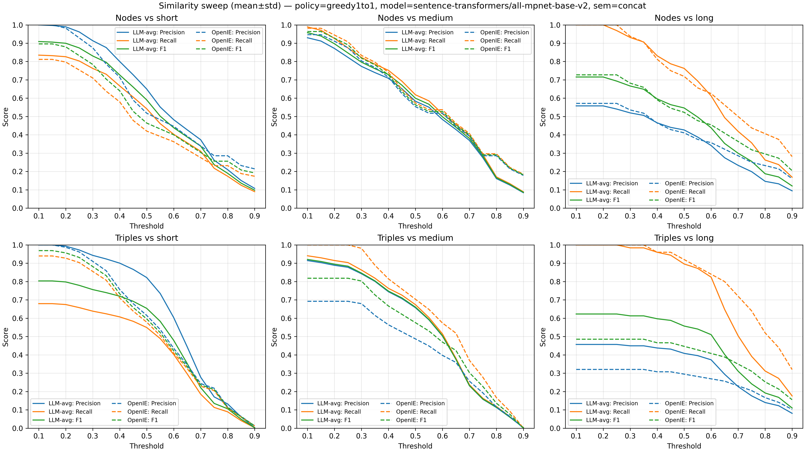
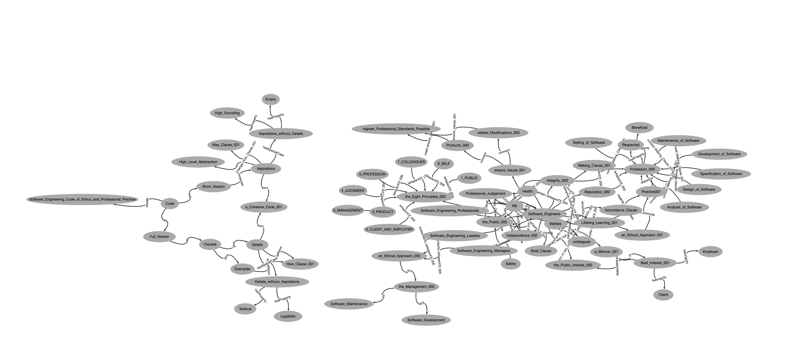
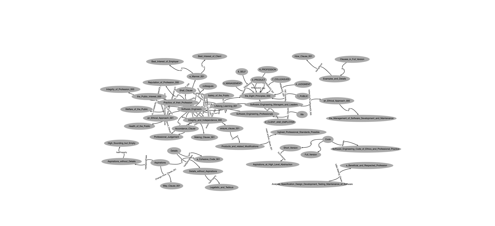
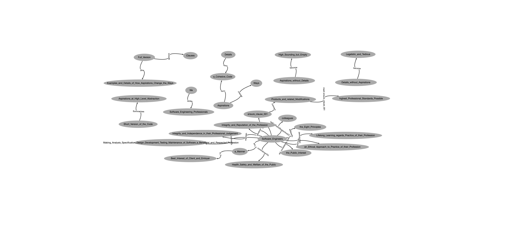
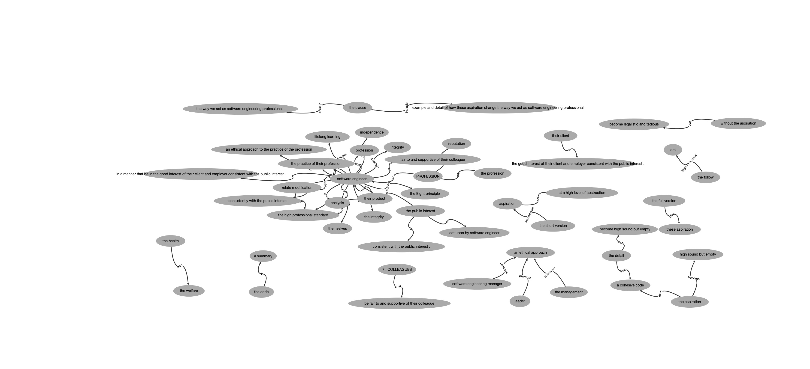
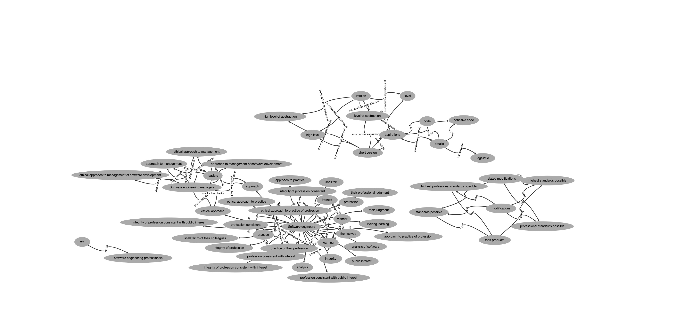

# ontology_se_standards

## https://www.acm.org/code-of-ethics/software-engineering-code

##How to run the evaluation

### Install the venv
-Navigate to your work folder
python3.11 -m venv .venv
source .venv/bin/activate

### Install the dependencies
pip install -r requirements.txt

python3 ontology_triple_eval_multiavg_2025.py \
  pred.json --pred-list "pred2.json pred3.json pred4.json pred5.json" \
  --pred1-label LLM-avg --pred2 pred_openIE.json --pred2-label OpenIE \
  --gold-short gold-short.json --gold-medium gold-medium.json --gold-long gold-long.json \
  --node-sim --semantic --sem-mode concat \
  --model sentence-transformers/all-mpnet-base-v2 \
  --match-policy greedy1to1 \
  --delim-p " " --delim-o " " \
  --t-start 0.10 --t-end 0.90 --t-step 0.05 \
  --out-csv sweep_metrics_avg.csv \
  --plot-out sweep_curves_dual_avg.png

  The example curve image is written to: results_for_analysis/sweep_curves_dual_avg.png

  ## Figures

  ### Aggregate Curves

  
  
  ### Gold sets (short / medium / long)

  | Gold (short) | Gold (medium) | Gold (long) |
  |---|---|---|
  |  |  |  |

  ### Predictions

  | LLM Pred | OpenIE Pred |
  |---|---|
  |  |  |

